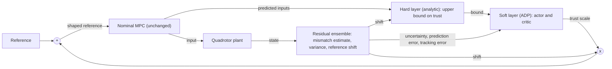

# How Much to Trust a Learned Model

**Safe Adaptive Dynamic Programming for Supervising Residual-Augmented Quadrotor MPC**

> **Status:** Phase 1 of 8 complete (first-principles dynamics). No controller, network, or supervisor code exists yet. See [Roadmap](#8-roadmap-and-status).

A learned residual model can make a quadrotor model predictive controller (MPC) better, leave it unchanged, or make it worse. This project asks **how much of a learned correction the controller should use at each moment**, and whether that decision can itself be learned with a guarantee that it does not degrade the nominal design.

The answer proposed here is a two-layer supervisor. An analytic **hard layer** computes an upper bound on trust from three closed-form quantities: actuator realizability, loop gain, and a barrier condition. Inside that bound, a learned **soft layer**, trained by adaptive dynamic programming (ADP), chooses the trust level. The nominal MPC is never modified, and zero trust reproduces it exactly.

The full method, equations, and analysis plan are in the research proposal: [`docs/Research_Proposal.pdf`](docs/Research_Proposal.pdf). This README is the summary.

---

## 1. Motivation

MPC is the standard tool for quadrotor trajectory tracking because it plans over a horizon while respecting actuator limits [1]. Its accuracy depends on its internal model, and mass change, rotor drag, motor lag, and actuation delay all cause mismatch. Learned residual models are the common remedy [5], [6], [7].

Our earlier study, presented at IEEE iCONEECT 2026 [19] ([code](https://github.com/Ashfak-Kausik/uav-mpc-learning)), injected a learned residual as a feedforward term into a quadrotor MPC in MuJoCo. The same accurate residual:

- **helped** under some mismatches,
- **did nothing** under others,
- **degraded tracking** under motor lag and delay near the stability boundary.

That study established the pattern but did not explain it. This repository is a clean-room rebuild that aims to explain it and to build a controller around the explanation. The earlier repository is treated as a frozen artifact: it is reproduced later as a check and never copied.

---

## 2. Research questions

| # | Question | Hypothesis |
|---|----------|------------|
| RQ1 | Which mechanism causes the harm, and does it survive a safer injection point? | Two mechanisms can degrade tracking at the reference level: **saturation** (the shifted reference demands more input than the rotors can deliver) and **loop gain** (the correction depends on the state, so it closes an extra feedback path around a loop whose margin lag and delay have already reduced). Mass is corrected at any trust level, drag changes little, and the harm under lag and delay comes mainly from loop gain, before any actuator saturates. Tested with an oracle correction before any network is trained. |
| RQ2 | Do the analytic bounds predict help and harm better than model uncertainty does? | The realizability ratio and the small-gain bound separate helpful from harmful corrections better than ensemble variance, measured as classification AUC. Labels come from paired rollouts with trust at 0 and at 1. |
| RQ3 | Can ADP learn the trust policy? | A learned soft layer achieves lower tracking cost than the nominal controller, the best fixed trust level, and an uncertainty-only gate, with one policy across all mismatch types, including unseen magnitudes and combinations. |
| RQ4 | What can be guaranteed? | Full transmission of the correction below the realizability ratio, stability and constraint satisfaction for any soft policy, and statistical non-degradation of the learned supervisor. |

If the degradation in RQ1 vanishes entirely, the role of the supervisor shifts from safety to performance. The method is unchanged in either case.

---

## 3. Method at a glance



**Mismatch model.** Motor lag and delay are dynamic, so the plant is modeled on an augmented state that includes the actuator states. The mismatch is the one-step prediction error of the nominal model, and a deep ensemble [15] predicts it from a short window of recent inputs.

**Reference shaping.** The predicted mismatch is mapped to a saturated reference shift, and the MPC receives a shaped reference:

```math
\tilde{r}_k = r_k + \alpha_k \, \Delta r_k, \qquad \alpha_k \in [0, \bar{\alpha}_k]
```

Here $\alpha_k$ is the trust scale and $\bar{\alpha}_k$ is its upper bound. With $\alpha_k = 0$ the system is exactly the nominal baseline.

**Hard layer (analytic, no second optimization).** Three closed-form bounds are combined, one per failure mechanism:

```math
\bar{\alpha}_k = \min\left( r_H, \; \alpha_{\mathrm{sg},k}, \; \alpha_{\mathrm{cbf},k} \right)
```

| Bound | Guards against | How it is computed |
|-------|----------------|--------------------|
| $r_H$, realizability ratio | Actuator saturation | The largest fraction of the requested correction that the rotors can absorb over the horizon under thrust and rate limits. A ratio test on the inputs the MPC already predicts, $O(Nm)$ divisions, no solver |
| $\alpha_{\mathrm{sg},k}$, small-gain bound | Loop gain of the correction path | From the small-gain theorem [36], [37]: trust times the Lipschitz constant of the correction map times the closed-loop gain must stay below one. The closed-loop gain is computed offline over the mismatch set |
| $\alpha_{\mathrm{cbf},k}$, barrier bound | State limits (tilt, altitude) | Discrete-time control barrier condition [20] with a robustness margin, using high-order constructions [11], [12] for the lateral channel |

Only quantities that can be bounded analytically enter the hard layer. Ensemble uncertainty is an estimate, so it is passed to the soft layer as information.

**Soft layer (learned).** The trust decision is posed as an optimal control problem with a seven-dimensional state and one action:

```math
s_k = \left( r_H, \; \alpha_{\mathrm{sg},k}, \; \psi_k, \; \iota_k, \; \|e_k\|, \; \|e_k\| - \|e_{k-1}\|, \; \alpha_{k-1} \right)
```

```math
\alpha_k = \Pi_{[0, \bar{\alpha}_k]}\left( \alpha_{k-1} + a_k \right), \qquad
J(\pi) = \mathbb{E}_{\theta}\left[ \sum_{k \ge 0} \gamma^k \left( e_k^{\top} Q \, e_k + \lambda a_k^2 \right) \right]
```

Here $\psi_k$ is a clipped measure of ensemble variance, $\iota_k$ is the ensemble's measured prediction error at the previous step, and $e_k$ is the tracking error. The action is a bounded increment of trust. The hard layer can cut trust immediately, while increases are rate limited. The policy is trained with action-dependent heuristic dynamic programming [13] on simulated rollouts across mismatch types and magnitudes.

**Safe policy improvement.** The policy that keeps trust at zero is the nominal MPC, so it is an admissible initial policy [14]. Every actor and critic update is then treated as a candidate. A candidate replaces the current policy only if paired rollouts show a statistically significant improvement on average and no loss beyond a tolerance on any single mismatch type [34], [39].

---

## 4. Theoretical targets

**Assumptions.** (1) The nominal controller is an MPC-for-tracking design [16], [38], recursively feasible for any reference change. (2) For every mismatch in the set under study, the nominal closed loop satisfies its constraints and is input-to-state stable with a finite gain. (3) The reference shift is bounded and Lipschitz. Assumption 2 sets the scope: no claim is made beyond the stability boundary of the nominal loop.

**Target Result 1: transmission of the correction.** For the linearized MPC, if no input constraint is active and trust is at or below the realizability ratio, no input constraint becomes active and the MPC acts as its unconstrained affine law [35]. The correction is transmitted in full.

**Target Result 2: safety for any soft policy.** For any trust level inside the hard bound, the MPC stays recursively feasible, the closed loop is input-to-state stable, and the barrier condition holds within its margin. This holds regardless of what the learning component does.

**Target Result 3: non-degradation of the learned supervisor.** With high probability, every policy accepted by the improvement test has expected cost no higher than the nominal controller, and no higher than nominal plus a tolerance on each mismatch type. The guarantee is statistical: it holds in expectation over the training distribution and inside the simulator.

These are targets, not established results.

---

## 5. Evaluation plan

**Setup.** A Crazyflie-scale quadrotor in MuJoCo; MPC-for-tracking in CasADi, with IPOPT during development and acados [40] for timing results; hover, circle, figure-eight, and an aggressive figure-eight close to the actuator limits. A second, heavier vehicle tests cross-vehicle generalization, and a second simulator provides a sim-to-sim check.

**Mismatches.** Mass, rotor drag, motor lag, and actuation delay, individually and in combination.

**Baselines.**

| # | Baseline | Question it answers |
|---|----------|---------------------|
| 1 | Nominal MPC (trust fixed at 0) | What must not be underperformed? |
| 2 | Unsupervised residual (trust fixed at 1) | What does the correction do with no supervision? |
| 3 | Best fixed trust level | Is a time-varying trust level needed? |
| 4 | Hard layer with a threshold rule, no learning | What does the ADP soft layer add? |
| 5 | Uncertainty-only gate [31] | Is realizability needed, or does uncertainty suffice? |
| 6 | Soft layer trained without the acceptance test | What does the safe improvement step add? |
| 7 | Residual inside the MPC model [5] | How much performance does reference-level injection give up? |
| 8 | Offset-free MPC [23] | Is a learned model needed for constant mismatch? |
| 9 | L1-adaptive MPC [24] | Is a learned model needed at all? |
| 10 | Predictive safety filter [9] | How does a closed-form bound compare with an online optimization? |
| 11 | Reference governor [17] | How does it compare with classical reference scaling? |

**Metrics.** RMS and peak tracking error, fraction of time in actuator saturation, number of constraint violations, per-step supervisor computation time on a CPU, and AUC of the analytic bounds versus ensemble variance for classifying helpful and harmful corrections. Results are reported over at least ten seeds with confidence intervals.

**Generalization and ablations.** Unseen mismatch magnitudes and combinations, and one mismatch type held out in rotation. Ablations remove each hard bound and each trust-state component in turn.

**Stress tests.** (1) Mismatch introduced during flight. (2) A deliberately corrupted residual network. (3) Mismatch increased past the stability boundary of the nominal loop, to locate where the claims stop.

---

## 6. Predictions recorded before any experiment

Notebook entry 04 classifies the four mismatches from an equilibrium analysis alone. These are recorded now so that experiments can confirm or refute them.

| Mismatch | Moves the hover equilibrium? | Channel | Predicted effect of an uncorrected residual |
|----------|------------------------------|---------|---------------------------------------------|
| Mass | Yes, a constant bias | Vertical (two integrators) | Helps |
| Drag | No, but breaks constant-velocity trim | Lateral, state dependent | Little change |
| Motor lag | No, it removes phase margin | Lateral (four integrators) | Hurts past a threshold |
| Delay | No, it removes phase margin faster | Lateral (four integrators) | Hurts, with an earlier threshold |

If the experiments contradict this table, the table changes and the reason is investigated.

---

## 7. Related work

| Line of work | Representative papers | What it leaves open |
|--------------|-----------------------|---------------------|
| Learned residuals in MPC | Aswani et al. [2], Torrente et al. [5], Salzmann et al. [6], O'Connell et al. [22] | The learned term is applied whenever it is available |
| Mismatch handling without a learned model | Pannocchia and Rawlings [23], Hanover et al. [24] | No learned correction to supervise |
| Safety layers and run-time assurance | Hewing et al. [8], Wabersich and Zeilinger [9], Garone et al. [17], Liu et al. [25], Sinha et al. [26] | Decide whether an action is safe, not how much of a correction is worth using |
| Gating and blending a learned correction | Cheng et al. [28], Cramer et al. [29], Jeon et al. [30], Colombo et al. [31], Iscan and Temiz [32] | The scale is fixed, a hand-designed function of uncertainty, or a discrete action with no baseline guarantee |
| Realizability versus accuracy | Wu et al. [33] | An offline certificate for repetitive systems, not a run-time bound for MPC |
| ADP and safe policy improvement | Liu and Wei [14], Wang et al. [12], Laroche et al. [34], Thomas et al. [39] | Learn the control policy itself, not the trust policy |

**Gap addressed.** To our knowledge, no existing method combines (i) a closed-form realizability bound on the use of a learned residual, evaluated at run time from the predicted inputs of the MPC, with (ii) a trust policy that is optimized inside that bound, initialized at the nominal controller, with non-degradation as an explicit target.

---

## 8. Roadmap and status

Each phase has an understanding gate (the reasoning can be explained in plain language) and a validation gate (a concrete check passes).

| Phase | Focus | Answers | Status |
|-------|-------|---------|--------|
| 1 | Quadrotor dynamics from first principles: frames, 13-state model, mixer, constraint polytope, hover equilibrium, linearization | | **Done** (notebook 00 to 04) |
| 2 | Simulator interface for a Crazyflie-scale vehicle; command and response validation against the derived equations | | Next |
| 3 | MPC-for-tracking, built term by term; validation on hover, line, circle, figure-eight | | Planned |
| 4 | Mismatch characterization; reference-level injection of an oracle correction | RQ1 | Planned |
| 5 | Residual ensemble with uncertainty; reference-shift mapping; trajectory-level holdouts | | Planned |
| 6 | Hard layer: realizability ratio, closed-loop gain and small-gain bound, barrier bound; regime map; Target Result 1 | RQ2 | Planned |
| 7 | ADP soft layer with the safe policy improvement step; baselines; Target Result 2 | RQ3, RQ4 | Planned |
| 8 | Target Result 3; cross-vehicle and second-simulator validation; stress tests | RQ4 | Planned |

Phases 1 to 4 correspond to the first semester of the proposal, 5 and 6 to the second (conference paper on the hard layer and regime map), 7 to the third, and 8 to the fourth (journal submission on the learned supervisor).

**Future directions.** On-board hardware deployment, for which the closed-form hard layer is designed; an online supervisor that narrows the mismatch set from flight data; and a distributed trust policy for formations, posed as a cooperative optimal control problem on graphs [18].

---

## 9. Repository structure

Current:

```
uav-mpc-safe-residual/
├── README.md
├── docs/
│   └── Research_Proposal.pdf
└── notebook/
    ├── 00_state_and_frames.md
    ├── 01_forces_and_torques.md
    ├── 02_translational_dynamics.md
    ├── 03_rotational_dynamics.md
    └── 04_hover_equilibrium.md
```

Planned, added as each phase begins:

```
src/           dynamics, simulator interface, MPC, reference shaping, perturbations,
               realizability, residual ensemble, supervisor (hard and soft layers), harness
configs/       one configuration file per reproducible run
experiments/   sweep specifications (regime map, oracle tests, stress tests)
tests/         unit and property tests (conservation laws, supervisor invariants)
```

---

## 10. Working principles

1. **Explain before proceeding.** No equation, signal, or ordering dependency is used until it can be explained in plain language.
2. **Oracle before network.** A perfect correction is tested through the injection pathway before any model is trained to produce it.
3. **The nominal MPC is never modified.** The learned correction only changes the reference. Zero trust must reproduce the nominal controller exactly, and this is unit tested.
4. **Predictions before experiments.** Qualitative predictions are written down before each experiment is run.
5. **Reproducibility.** CPU only, fully seeded, and every result traceable to a configuration file and a commit hash.

---

## 11. Open questions

These are tracked here so that they are settled by evidence and not by assumption.

- Which mechanism dominates under motor lag and delay at the reference injection point: saturation or loop gain? Phase 4 settles this with an oracle correction.
- In its first version the small-gain bound uses a fixed mismatch set, so it is a constant. How conservative is it, and how much does narrowing the set online recover?
- The realizability ratio is exact only for the linearized MPC. Its error on aggressive trajectories, and against the exact linear-program answer, needs to be measured.
- The map from predicted mismatch to reference shift still needs a full derivation (notebook 07).
- Non-degradation is guaranteed only in expectation over the training distribution. How does the learned policy behave under a shifted distribution?

---

## 12. Tooling

Python, MuJoCo for simulation [43], CasADi [41] with IPOPT [42] and acados [40] for optimization-based control, and PyTorch for the learned components.

---

## 13. Author

MD Ashfakul Karim Kausik. Earlier work: [uav-mpc-learning](https://github.com/Ashfak-Kausik/uav-mpc-learning) [19].

---

## 14. References

[1] J. B. Rawlings, D. Q. Mayne, and M. M. Diehl, *Model Predictive Control: Theory, Computation, and Design*, 2nd ed., Nob Hill Publishing, 2017.

[2] A. Aswani, H. Gonzalez, S. S. Sastry, and C. J. Tomlin, "Provably safe and robust learning-based model predictive control," *Automatica*, vol. 49, no. 5, 2013.

[3] P. Bouffard, A. Aswani, and C. J. Tomlin, "Learning-based model predictive control on a quadrotor: Onboard implementation and experimental results," *Proc. IEEE ICRA*, 2012.

[4] T. Koller, F. Berkenkamp, M. Turchetta, and A. Krause, "Learning-based model predictive control for safe exploration," *Proc. IEEE CDC*, 2018.

[5] G. Torrente, E. Kaufmann, P. Foehn, and D. Scaramuzza, "Data-driven MPC for quadrotors," *IEEE Robotics and Automation Letters*, vol. 6, no. 2, 2021.

[6] T. Salzmann, E. Kaufmann, J. Arrizabalaga, M. Pavone, D. Scaramuzza, and M. Ryll, "Real-time neural MPC: Deep learning model predictive control for quadrotors and agile robotic platforms," *IEEE Robotics and Automation Letters*, vol. 8, no. 4, 2023.

[7] A. Saviolo and G. Loianno, "Learning quadrotor dynamics for precise, safe, and agile flight control," *Annual Reviews in Control*, vol. 55, 2023.

[8] L. Hewing, J. Kabzan, and M. N. Zeilinger, "Cautious model predictive control using Gaussian process regression," *IEEE Trans. Control Systems Technology*, vol. 28, no. 6, 2020.

[9] K. P. Wabersich and M. N. Zeilinger, "A predictive safety filter for learning-based control," *Proc. IEEE CDC*, 2021.

[10] F. Berkenkamp, R. Moriconi, A. P. Schoellig, and A. Krause, "Safe learning of dynamic systems," *Proc. IEEE CDC*, 2017.

[11] X. Zhang, S. M. R. St. John, X. Yang, and J. W. Grizzle, "Safety-critical synthesis via high-order control barrier functions," *Proc. IEEE CDC*, 2020.

[12] Q. Wang, X. Zhang, and H. Wang, "Safe and stable reinforcement learning via barrier certificates," *IEEE Trans. Automatic Control*, vol. 67, no. 8, 2022.

[13] F. L. Lewis and D. Vrabie, "Reinforcement learning and adaptive dynamic programming for feedback control," *IEEE Circuits and Systems Magazine*, vol. 9, no. 3, 2009.

[14] Y. Liu and C. Wei, "Admissible initial policies in adaptive dynamic programming," *Automatica*, vol. 115, 2020.

[15] B. Lakshminarayanan, A. Pritzel, and C. Blundell, "Simple and scalable predictive uncertainty estimation using deep ensembles," *Advances in Neural Information Processing Systems*, 2017.

[16] J. B. Rawlings and M. J. S. de la Peña, "Stability and robustness for model predictive control," *Proc. IEEE CDC*, 2007.

[17] E. Garone, S. Di Cairano, and A. Bemporad, "Reference and command governors for constrained systems: A tutorial overview," *IEEE Control Systems Magazine*, vol. 38, no. 1, 2018.

[18] M. Mesbahi and M. Egerstedt, *Graph Theoretic Methods in Multiagent Networks*, Princeton University Press, 2010.

[19] M. A. K. Kausik, "uav-mpc-learning," GitHub repository, 2026.

[20] A. D. Ames, X. Xu, J. W. Grizzle, and P. Tabuada, "Control barrier function based quadratic programs with application to autonomous driving," *Proc. IEEE CDC*, 2014.

[21] S. Sha, "Aero-acoustic optimization for quadrotor safety constraints," *PhD thesis*, 2020.

[22] M. O'Connell, G. Shi, X. Shi, K. Azizzadenesheli, A. Anandkumar, Y. Yue, and S.-J. Chung, "Neural-Fly enables rapid learning for agile flight in strong winds," *Science Robotics*, vol. 7, no. 66, 2022.

[23] G. Pannocchia and J. B. Rawlings, "Disturbance models for offset-free model-predictive control," *AIChE Journal*, vol. 49, no. 2, 2003.

[24] D. Hanover, P. Foehn, S. Sun, E. Kaufmann, and D. Scaramuzza, "Performance, precision, and payloads: Adaptive nonlinear MPC for quadrotors," *IEEE Robotics and Automation Letters*, vol. 7, no. 1, 2022.

[25] K. Liu, N. Li, I. Kolmanovsky, D. Rizzo, and A. Girard, "Safe learning reference governor: Theory and application to fuel truck rollover avoidance," arXiv:2101.09298, 2021.

[26] R. Sinha, E. Schmerling, and M. Pavone, "Closing the loop on runtime monitors with fallback-safe MPC," *Proc. IEEE CDC*, 2023.

[27] T. Johannink, S. Bahl, A. Nair, J. Luo, A. Kumar, M. Loskyll, J. A. Ojea, E. Solowjow, and S. Levine, "Residual reinforcement learning for robot control," *Proc. IEEE ICRA*, 2019.

[28] R. Cheng, A. Verma, G. Orosz, S. Chaudhuri, Y. Yue, and J. Burdick, "Control regularization for reduced variance reinforcement learning," *Proc. ICML*, 2019.

[29] E. Cramer, B. Frauenknecht, R. Sabirov, and S. Trimpe, "Contextualized hybrid ensemble Q-learning: Learning fast with control priors," arXiv:2406.19768, 2024.

[30] S. H. Jeon, H. J. Lee, S. Hong, and S. Kim, "Residual MPC: Blending reinforcement learning with GPU-parallelized model predictive control," arXiv:2510.12717, 2025.

[31] L. Colombo, T. Beckers, and J. Giribet, "Aggressiveness-aware learning-based control of quadrotor UAVs with safety guarantees," arXiv:2602.21936, 2026.

[32] M. Iscan and B. Temiz, "Autopilot-preserving residual Q-learning with HJB-inspired finite-action risk filtering for fixed-wing UAV command supervision," arXiv:2606.01397, 2026.

[33] Y. Wu, Y. Cao, and J. Cao, "Input-to-state stability certification via projection residuals for Koopman learning control of nonlinear repetitive systems," arXiv:2607.06459, 2026.

[34] R. Laroche, P. Trichelair, and R. Tachet des Combes, "Safe policy improvement with baseline bootstrapping," *Proc. ICML*, 2019.

[35] A. Bemporad, M. Morari, V. Dua, and E. N. Pistikopoulos, "The explicit linear quadratic regulator for constrained systems," *Automatica*, vol. 38, no. 1, 2002.

[36] Z.-P. Jiang, A. R. Teel, and L. Praly, "Small-gain theorem for ISS systems and applications," *Mathematics of Control, Signals, and Systems*, vol. 7, 1994.

[37] Z.-P. Jiang and Y. Wang, "Input-to-state stability for discrete-time nonlinear systems," *Automatica*, vol. 37, no. 6, 2001.

[38] D. Limon, A. Ferramosca, I. Alvarado, and T. Alamo, "Nonlinear MPC for tracking piece-wise constant reference signals," *IEEE Trans. Automatic Control*, vol. 63, no. 11, 2018.

[39] P. S. Thomas, G. Theocharous, and M. Ghavamzadeh, "High confidence policy improvement," *Proc. ICML*, 2015.

[40] R. Verschueren, G. Frison, D. Kouzoupis, J. Frey, N. van Duijkeren, A. Zanelli, B. Novoselnik, T. Albin, R. Quirynen, and M. Diehl, "acados: A modular open-source framework for fast embedded optimal control," *Mathematical Programming Computation*, vol. 14, 2022.

[41] J. A. E. Andersson, J. Gillis, G. Horn, J. B. Rawlings, and M. Diehl, "CasADi: A software framework for nonlinear optimization and optimal control," *Mathematical Programming Computation*, vol. 11, no. 1, 2019.

[42] A. Waechter and L. T. Biegler, "On the implementation of an interior-point filter line-search algorithm for large-scale nonlinear programming," *Mathematical Programming*, vol. 106, no. 1, 2006.

[43] E. Todorov, T. Erez, and Y. Tassa, "MuJoCo: A physics engine for model-based control," *Proc. IEEE/RSJ IROS*, 2012.