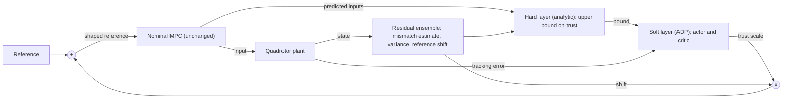

# How Much to Trust a Learned Model

**Safe Adaptive Dynamic Programming for Supervising Residual-Augmented Quadrotor MPC**

> **Status:** Phase 1 of 8 complete (first-principles dynamics). No controller, network, or supervisor code exists yet. See [Roadmap](#8-roadmap-and-status).

A learned residual model can make a quadrotor model predictive controller (MPC) better, leave it unchanged, or make it worse. This project asks **how much of a learned correction the controller should use at each moment**, and whether that decision can itself be learned without ever making the controller worse than its nominal design.

The answer proposed here is a two-layer supervisor. An analytic **hard layer** computes an upper bound on trust in closed form. Inside that bound, a learned **soft layer**, trained by adaptive dynamic programming (ADP), chooses the trust level. The nominal MPC is never modified, and zero trust reproduces it exactly.

The full method, equations, and analysis plan are in the research proposal: [`docs/Research_Proposal.pdf`](docs/Research_Proposal.pdf). This README is the summary.

---

## 1. Motivation

MPC is the standard tool for quadrotor trajectory tracking because it plans over a horizon while respecting actuator limits [1]. Its accuracy depends on its internal model, and mass change, rotor drag, motor lag, and actuation delay all cause mismatch. Learned residual models are the common remedy [5], [6], [7].

Our earlier study, presented at IEEE iCONEECT 2026 [19] ([code](https://github.com/Ashfak-Kausik/uav-mpc-learning)), injected a learned residual as a feedforward term into a quadrotor MPC in MuJoCo. The same accurate residual:

- **helped** under some mismatches,
- **did nothing** under others,
- **degraded tracking** under motor lag and delay near the stability boundary.

That study established the pattern but did not explain it. This repository is a clean-room rebuild that aims to explain it and to build a controller around the explanation. The earlier repository is treated as a frozen artifact: it is reproduced later as a check and never copied.

---

## 2. Research questions

| # | Question | Hypothesis |
|---|----------|------------|
| RQ1 | Does the harm survive a safer injection point? | When the correction only shifts the reference of the MPC, it can no longer bypass actuator constraints. Degradation should largely disappear, except when the shifted reference demands more input than the vehicle can deliver within the horizon (expected mainly under motor lag and delay). |
| RQ2 | Is realizability a better predictor than accuracy? | A closed-form realizability ratio separates helpful from harmful corrections across mismatch types better than ensemble variance does, measured as classification AUC over the regime map. |
| RQ3 | Can ADP learn the trust policy? | A learned soft layer achieves lower tracking cost than both the nominal controller and the best fixed trust level, with one policy across all mismatch types and no per-mismatch tuning. |
| RQ4 | What can be guaranteed? | Recursive feasibility and bounded tracking for any soft policy, and non-degradation relative to the nominal controller for the learned one. |

If the degradation in RQ1 vanishes entirely, the role of the supervisor shifts from safety to performance. The method is unchanged in either case.

---

## 3. Method at a glance



**Reference shaping.** A deep ensemble [15] predicts the model mismatch and its variance, and the prediction is mapped to a saturated reference shift. The MPC receives a shaped reference:

```math
\tilde{r}_k = r_k + \alpha_k \, \Delta r_k, \qquad \alpha_k \in [0, \bar{\alpha}_k]
```

Here $\alpha_k$ is the trust scale and $\bar{\alpha}_k$ is its upper bound. With $\alpha_k = 0$ the system is exactly the nominal baseline.

**Hard layer (analytic, no second optimization).** Three closed-form bounds are combined:

```math
\bar{\alpha}_k = \min\left( r_H, \; \psi_k, \; \alpha_{\mathrm{cbf},k} \right)
```

| Bound | Meaning | How it is computed |
|-------|---------|--------------------|
| $r_H$ | Realizability ratio: the largest fraction of the requested correction that the rotors can absorb over the horizon, under thrust and rate limits | A ratio test on the predicted inputs the MPC already returns, using input sensitivities linearized about hover. A minimum of $O(Nm)$ divisions, no solver |
| $\psi_k$ | Uncertainty gate | Ensemble variance clipped between two calibration thresholds. Treated as necessary, not sufficient, for trust |
| $\alpha_{\mathrm{cbf},k}$ | Barrier bound | Discrete-time control barrier condition [20] on tilt and altitude limits, using high-order constructions [11], [12] for the lateral channel |

**Soft layer (learned).** The trust decision is posed as an optimal control problem with a five-dimensional state and one action:

```math
s_k = \left( r_H, \; \psi_k, \; \|e_k\|, \; \|e_k\| - \|e_{k-1}\|, \; \alpha_{k-1} \right)
```

```math
\alpha_k = \Pi_{[0, \bar{\alpha}_k]}\left( \alpha_{k-1} + a_k \right), \qquad
J^{\pi}(s_0) = \sum_{k \ge 0} \gamma^k \left( e_k^{\top} Q \, e_k + \lambda a_k^2 \right)
```

The action is a bounded increment of trust. The hard layer can cut trust immediately, while increases are rate limited. The policy is trained with action-dependent heuristic dynamic programming [13], an actor and critic scheme, by policy iteration on simulated rollouts across mismatch types and magnitudes.

**Why the nominal controller is the starting point.** Policy iteration needs an admissible initial policy [14]. Here one exists by construction: the policy that keeps trust at zero is the nominal MPC. Starting from it ties every later iterate to the baseline it must not underperform.

---

## 4. Theoretical targets

**Assumption.** The nominal controller is an MPC-for-tracking design [16]: recursively feasible for any reference change, and input-to-state stable with respect to the rate of variation of its reference.

**Target Result 1: safety for any soft policy.** For any trust level inside the hard bound, the closed loop stays recursively feasible, the barrier condition is preserved to first order, and the tracking error is ultimately bounded. This holds regardless of what the learning component does, so the soft layer can be trained without compromising safety.

**Target Result 2: non-degradation of the learned supervisor.** With exact policy evaluation, policy iteration from the nominal policy never increases cost. With a bounded critic error, the learned policy is no worse than the nominal controller up to a term that scales with that error. This is the principal theoretical challenge, because the admissible action set is state dependent and the critic is approximate.

These are targets, not established results.

---

## 5. Evaluation plan

**Setup.** Quadrotor in MuJoCo; MPC-for-tracking in CasADi with IPOPT; hover, circle, and figure-eight trajectories; a second vehicle with different inertial properties for cross-vehicle generalization.

**Mismatches.** Mass, rotor drag, motor lag, and actuation delay, individually and in combination.

**Baselines.**

| # | Baseline | Purpose |
|---|----------|---------|
| 1 | Nominal MPC (trust fixed at 0) | The controller that must not be underperformed |
| 2 | Unsupervised residual (trust fixed at 1) | The correction with no supervision |
| 3 | Best fixed trust level | Tests whether a learned, time-varying policy is needed |
| 4 | Hard layer with a threshold rule, no learning | Isolates the contribution of the ADP soft layer |
| 5 | Predictive safety filter [9] | Optimization-based safety layer |
| 6 | Reference governor [17] | Classical reference-scaling approach |

**Metrics.** RMS and peak tracking error, fraction of time in actuator saturation, number of constraint violations, per-step supervisor computation time on a CPU, and AUC of $r_H$ versus ensemble variance for classifying helpful and harmful corrections.

**Stress tests.** (1) Mismatch introduced during flight. (2) A deliberately corrupted residual network. Both check that the supervisor reverts to the nominal controller.

---

## 6. Predictions recorded before any experiment

Notebook entry 04 classifies the four mismatches from an equilibrium analysis alone. These are recorded now so that experiments can confirm or refute them.

| Mismatch | Moves the hover equilibrium? | Channel | Predicted effect of an uncorrected residual |
|----------|------------------------------|---------|---------------------------------------------|
| Mass | Yes, a constant bias | Vertical (two integrators) | Helps |
| Drag | No, but breaks constant-velocity trim | Lateral, state dependent | Little change |
| Motor lag | No, it removes phase margin | Lateral (four integrators) | Hurts past a threshold |
| Delay | No, it removes phase margin faster | Lateral (four integrators) | Hurts, with an earlier threshold |

If the experiments contradict this table, the table changes and the reason is investigated.

---

## 7. Related work

| Line of work | Representative papers | What it leaves open |
|--------------|-----------------------|---------------------|
| Learning-based MPC with guarantees | Aswani et al. [2], Bouffard et al. [3] | The learned term is used whenever it is available |
| Learned residuals for agile flight | Torrente et al. [5], Salzmann et al. [6], Saviolo and Loianno [7] | Improve model accuracy and apply the learned term unconditionally |
| Uncertainty-aware MPC | Hewing et al. [8], Koller et al. [4] | Tighten constraints; do not decide how much of a correction is worth using |
| Safety filters and governors | Wabersich and Zeilinger [9], Garone et al. [17], Ames et al. [20], Sha [21] | Decide whether an action is safe, often with an online optimization; binary or conservative by design |
| ADP and safe reinforcement learning | Lewis and Vrabie [13], Liu and Wei [14], Berkenkamp et al. [10], Zhang et al. [11], Wang et al. [12] | Learn the control policy itself, not the trust policy between a nominal controller and a learned model |

**Gap addressed.** To our knowledge, no existing method (i) bounds the use of a learned residual by a solver-free measure of whether the actuators can realize it, and (ii) learns, inside that bound, a trust policy with a non-degradation guarantee relative to the nominal controller.

---

## 8. Roadmap and status

Each phase has an understanding gate (the reasoning can be explained in plain language) and a validation gate (a concrete check passes).

| Phase | Focus | Answers | Status |
|-------|-------|---------|--------|
| 1 | Quadrotor dynamics from first principles: frames, 13-state model, mixer, constraint polytope, hover equilibrium, linearization | | **Done** (notebook 00 to 04) |
| 2 | Simulator interface; command and response validation against the derived equations | | Next |
| 3 | MPC-for-tracking, built term by term; validation on hover, line, circle, figure-eight | | Planned |
| 4 | Mismatch characterization; reference-level injection of an oracle correction | RQ1 | Planned |
| 5 | Residual ensemble with uncertainty; reference-shift mapping; trajectory-level holdouts | | Planned |
| 6 | Hard layer: realizability ratio, uncertainty gate, barrier bound; regime map | RQ2 | Planned |
| 7 | ADP soft layer by policy iteration from the nominal policy; Target Result 1 | RQ3, RQ4 | Planned |
| 8 | Target Result 2; cross-vehicle validation; stress tests | RQ4 | Planned |

Phases 1 to 4 correspond to the first semester of the proposal, 5 and 6 to the second (conference paper), 7 to the third, and 8 to the fourth (journal submission).

**Future directions.** On-board hardware deployment, for which the closed-form hard layer is designed, and a distributed trust policy for formations, posed as a cooperative optimal control problem on graphs [18].

---

## 9. Repository structure

Current:

```
uav-mpc-safe-residual/
├── README.md
├── docs/
│   └── Research_Proposal.pdf
└── notebook/
    ├── 00_state_and_frames.md
    ├── 01_forces_and_torques.md
    ├── 02_translational_dynamics.md
    ├── 03_rotational_dynamics.md
    └── 04_hover_equilibrium.md
```

Planned, added as each phase begins:

```
src/           dynamics, simulator interface, MPC, reference shaping, perturbations,
               realizability, residual ensemble, supervisor (hard and soft layers), harness
configs/       one configuration file per reproducible run
experiments/   sweep specifications (regime map, oracle tests, stress tests)
tests/         unit and property tests (conservation laws, supervisor invariants)
```

---

## 10. Working principles

1. **Explain before proceeding.** No equation, signal, or ordering dependency is used until it can be explained in plain language.
2. **Oracle before network.** A perfect correction is tested through the injection pathway before any model is trained to produce it.
3. **The nominal MPC is never modified.** The learned correction only changes the reference. Zero trust must reproduce the nominal controller exactly, and this is unit tested.
4. **Predictions before experiments.** Qualitative predictions are written down before each experiment is run.
5. **Reproducibility.** CPU only, fully seeded, and every result traceable to a configuration file and a commit hash.

---

## 11. Open questions

These are tracked here so that they are settled by evidence and not by assumption.

- Notebook 04 attributes the harm under motor lag and delay to lost phase margin, while RQ1 attributes it to input saturation within the horizon. The realizability ratio measures the second. Phase 4 must establish which mechanism dominates at the reference injection point.
- The realizability ratio uses sensitivities linearized about hover. Its accuracy on aggressive trajectories, and against the exact linear-program answer, needs to be measured.
- The trust state hides the plant state and the mismatch. Whether five features are enough for one policy across all mismatch types is an empirical question for Phase 7.
- The baseline set may grow as the related work is surveyed further.

---

## 12. Tooling

Python, MuJoCo for simulation [24], CasADi [22] with IPOPT [23] for optimization-based control, and PyTorch for the learned components.

---

## 13. Author

MD Ashfakul Karim Kausik. Earlier work: [uav-mpc-learning](https://github.com/Ashfak-Kausik/uav-mpc-learning) [19].

---

## 14. References

[1] J. B. Rawlings, D. Q. Mayne, and M. M. Diehl, *Model Predictive Control: Theory, Computation, and Design*, 2nd ed., Nob Hill Publishing, 2017.

[2] A. Aswani, H. Gonzalez, S. S. Sastry, and C. J. Tomlin, "Provably safe and robust learning-based model predictive control," *Automatica*, vol. 49, no. 5, 2013.

[3] P. Bouffard, A. Aswani, and C. J. Tomlin, "Learning-based model predictive control on a quadrotor: Onboard implementation and experimental results," *Proc. IEEE ICRA*, 2012.

[4] T. Koller, F. Berkenkamp, M. Turchetta, and A. Krause, "Learning-based model predictive control for safe exploration," *Proc. IEEE CDC*, 2018.

[5] G. Torrente, E. Kaufmann, P. Foehn, and D. Scaramuzza, "Data-driven MPC for quadrotors," *IEEE Robotics and Automation Letters*, vol. 6, no. 2, 2021.

[6] T. Salzmann, E. Kaufmann, J. Arrizabalaga, M. Pavone, D. Scaramuzza, and M. Ryll, "Real-time neural MPC: Deep learning model predictive control for quadrotors and agile robotic platforms," *IEEE Robotics and Automation Letters*, vol. 8, no. 4, 2023.

[7] A. Saviolo and G. Loianno, "Learning quadrotor dynamics for precise, safe, and agile flight control," *Annual Reviews in Control*, vol. 55, 2023.

[8] L. Hewing, J. Kabzan, and M. N. Zeilinger, "Cautious model predictive control using Gaussian process regression," *IEEE Trans. Control Systems Technology*, vol. 28, no. 6, 2020.

[9] K. P. Wabersich and M. N. Zeilinger, "A predictive safety filter for learning-based control of constrained nonlinear dynamical systems," *Automatica*, vol. 129, 2021.

[10] F. Berkenkamp, M. Turchetta, A. P. Schoellig, and A. Krause, "Safe model-based reinforcement learning with stability guarantees," *Proc. NeurIPS*, 2017.

[11] T. Zhang, J. Xu, and H. Zhang, "Enhancing safety in model-based reinforcement learning with high-order control barrier functions," *Int. J. Robust and Nonlinear Control*, vol. 35, pp. 3844-3855, 2025.

[12] X. Wang, H. Zhang, S. Wang, W. Xiao, and M. Guay, "Safe learning control with optimality and stability guarantees," *IEEE Trans. Automatic Control*, 2026, doi: 10.1109/TAC.2026.3707508.

[13] F. L. Lewis and D. Vrabie, "Reinforcement learning and adaptive dynamic programming for feedback control," *IEEE Circuits and Systems Magazine*, vol. 9, no. 3, 2009.

[14] D. Liu and Q. Wei, "Policy iteration adaptive dynamic programming algorithm for discrete-time nonlinear systems," *IEEE Trans. Neural Networks and Learning Systems*, vol. 25, no. 3, 2014.

[15] B. Lakshminarayanan, A. Pritzel, and C. Blundell, "Simple and scalable predictive uncertainty estimation using deep ensembles," *Proc. NeurIPS*, 2017.

[16] D. Limon, I. Alvarado, T. Alamo, and E. F. Camacho, "MPC for tracking piecewise constant references for constrained linear systems," *Automatica*, vol. 44, no. 9, 2008.

[17] E. Garone, S. Di Cairano, and I. Kolmanovsky, "Reference and command governors for systems with constraints: A survey on theory and applications," *Automatica*, vol. 75, 2017.

[18] H. Zhang, F. L. Lewis, and A. Das, "Optimal design for synchronization of cooperative systems: State feedback, observer and output feedback," *IEEE Trans. Automatic Control*, vol. 56, no. 8, 2011.

[19] M. A. K. Kausik et al., "Learning-augmented control for quadrotor MPC in MuJoCo: When a feedforward residual architecture helps, hurts, or does nothing," to appear in *Proc. IEEE iCONEECT*, 2026.

[20] A. D. Ames, S. Coogan, M. Egerstedt, G. Notomista, K. Sreenath, and P. Tabuada, "Control barrier functions: Theory and applications," *Proc. European Control Conference (ECC)*, 2019.

[21] L. Sha, "Using simplicity to control complexity," *IEEE Software*, vol. 18, no. 4, 2001.

[22] J. A. E. Andersson, J. Gillis, G. Horn, J. B. Rawlings, and M. Diehl, "CasADi: A software framework for nonlinear optimization and optimal control," *Mathematical Programming Computation*, vol. 11, no. 1, 2019.

[23] A. Waechter and L. T. Biegler, "On the implementation of an interior-point filter line-search algorithm for large-scale nonlinear programming," *Mathematical Programming*, vol. 106, no. 1, 2006.

[24] E. Todorov, T. Erez, and Y. Tassa, "MuJoCo: A physics engine for model-based control," *Proc. IEEE/RSJ IROS*, 2012.